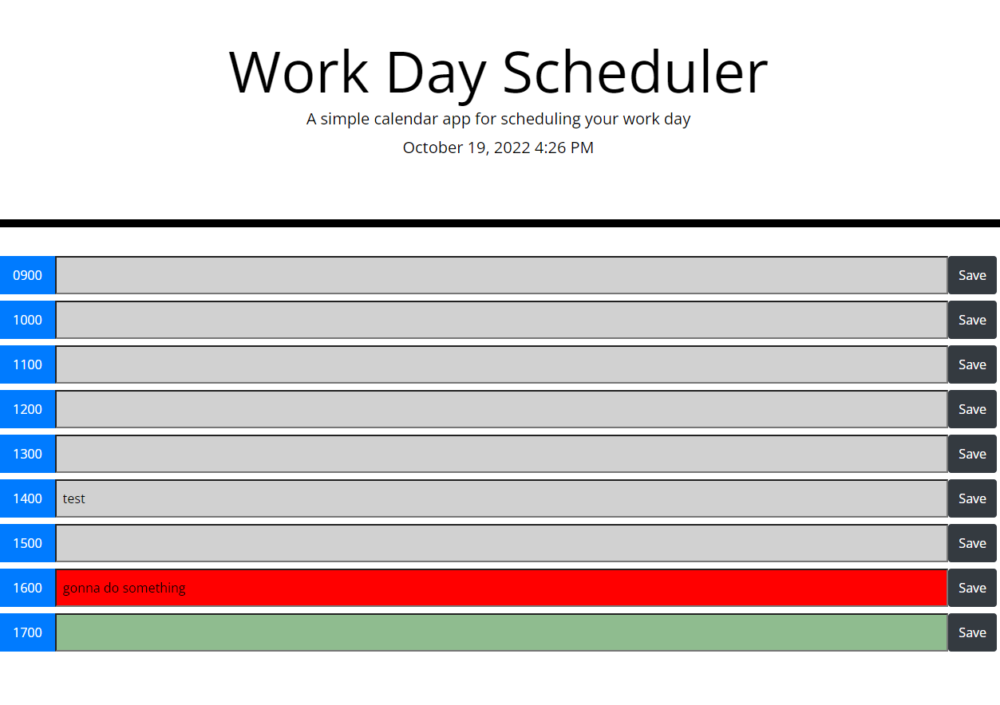

# workDayScheduler

This app allows you to create a schedule for your work day. This app takes your input and saves it into localStorage, which will persist upon refreshing the page. The inputs are color coded based on the time of the day. Inputs colored as grey have passed, an input colored as red is the current hour, inputs colored as green are in the future. 

## Installation

N/A 

## Usage

Find deployed application here https://iskry.github.io/workDayScheduler/ 

## Contributing
Pull requests are welcome. For major changes, please open an issue first to discuss what you would like to change.

## License
[MIT](https://choosealicense.com/licenses/mit/)